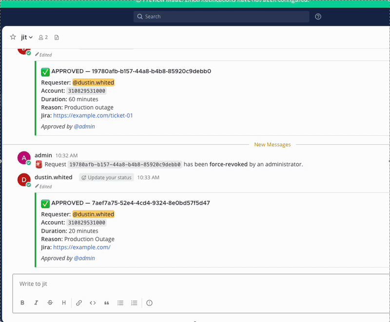

# mattermost-plugin-aws-jit-access

Mattermost plugin for Just-In-Time AWS access management.

This plugin requires [jit-aws-controller](https://github.com/dgwhited/jit-aws-controller) as its backend. Deploy the controller and configure the API Gateway endpoint as the **Backend API URL** in the plugin settings.

## Demo



## Commands

| Command | Description |
|---------|-------------|
| `/jit request` | Request temporary AWS access for an account bound to the current channel |
| `/jit bind` | Bind an AWS account and permission set to the current channel |
| `/jit approvers` | Set the list of approvers for the current channel |
| `/jit revoke` | Revoke an active access grant |
| `/jit status` | Check the status of access requests in the current channel |
| `/jit help` | Display usage information |

## Configuration

The plugin is configured through the Mattermost System Console with the following settings:

| Setting | Description |
|---------|-------------|
| Backend API URL | URL of the jit-aws-controller API Gateway endpoint |
| Signing Key ID | Key ID for HMAC signing of outbound requests |
| Signing Key Secret | Secret for HMAC signing of outbound requests |
| Callback Signing Secret | Secret for validating inbound webhook callbacks |

## Build

```sh
# Build server binaries for all platforms
make build

# Create a .tar.gz plugin bundle for upload to Mattermost
make bundle

# Run tests
make test
```
